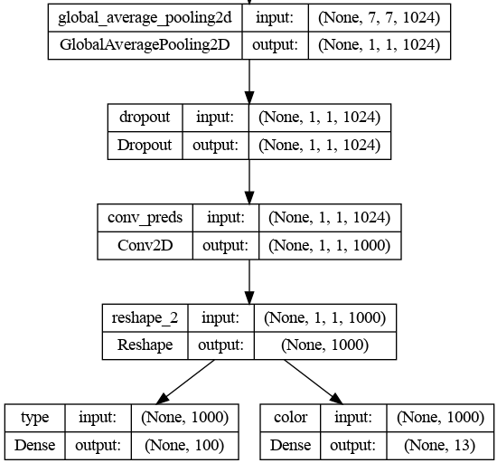
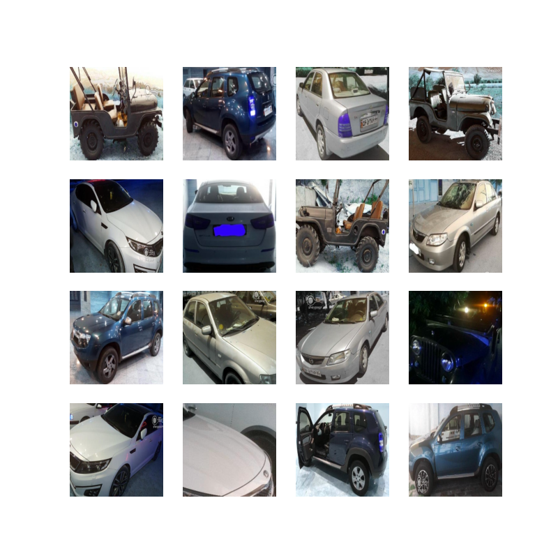
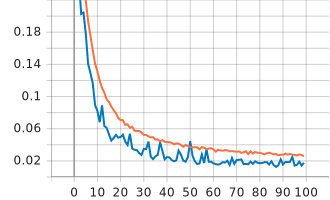
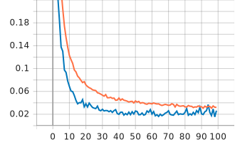
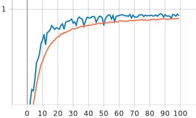
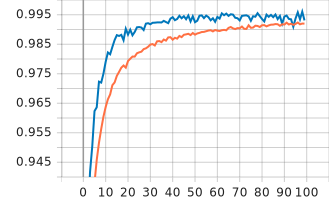

# Multi-Label Classifier with MobileNet

 is developed for classifying car color and car type. Backbone of model is MobileNet. 
The last layer outputs of backbone are passed to 2 fully connected layers with softmax activation function.



The current project is implemented using keras framework and trained from scratch and the MobileNet weights are initialized 
with ImageNet weights. 

**Model Summary**:

```
__________________________________________________________________________________________________
 Layer (type)                Output Shape              Param #   
==================================================================================================
 input_1 (InputLayer)        [(None, 224, 224, 3)]       0    
      
 mobilenet_layer                (None, 1000)         4253864     [feature_extractor]
                                                                 
 type (Dense)                   (None, 100)          100100      ['reshape_2[0][0]']              
                                                                                                  
 color (Dense)                  (None, 13)           13013       ['reshape_2[0][0]']              
                                                                                                  
==================================================================================================
Total params: 4,366,977
Trainable params: 4,345,089
Non-trainable params: 21,888
__________________________________________________________________________________________________
```

## Dataset

The model is trained on car dataset contain 151,118 car images with 13 different colors and 100 
different types label. 80 percent of data is used for training and 20 percent of data is used for 
validation set. All images are resized to 224 height and 224 width in training process. 




## Install Prerequisites

To install prerequisites run the following command:

```shell
$ sudo apt install python3 python3-wheel python3-pip python3-venv python3-dev python3-setuptools
```

## Create Virtual Environment

Create an isolated [Python virtual environment](https://docs.python.org/3/library/venv.html) using the `venv` standard
library module. This will keep dependant Python packages from interfering with other Python projects on your system.

```shell
$ python3 -m venv venv
$ source venv/bin/activate
```

Once activated, update core packaging tools (`pip`, `setuptools`, and `wheel`) to the latest versions.

```shell
(venv) $ pip install --upgrade pip setuptools wheel
```

## Install Requirements

To install requirements, run the following command:

```shell
(venv) $ pip install -r requirements.txt
````

## Training

To train the network with car dataset, run the following command:


```shell
(venv) $ python ./train.py
```


**Train config**:

```shell
epoch_num: number of epochs 
train_image_size: size of image in dataset 
dataset_path: dataset image path 
val_labels: labels of validation set contain 2 labels and images address in csv file 
train_labels: labels of train set contain 2 labels and images address in csv file 
model_plot: if true return model architecture
pad_resize: if true images will pad and resize if false images just will resize 
batch_size: number of batch size 
color_label: a dictionary that map color index to color name 
type_label: a dictionary that map type index to type name 
```
labels csv should be structured as below:

| images     | color       | type       | 
|------------|-------------|------------|
| image_path | color_index | type_index |
| image_path | color_index | type_index |

**Visualizing Metrics**:

TensorBoard is a visualization tool provided with TensorFlow to tracking and visualizing metrics such as loss and
accuracy.

To launch TensorBoard, run the following command:

```shell
(venv) $ tensorboard --logdir ./logs
```

| Epoch    | color                                  | type                                  | 
|----------|----------------------------------------|---------------------------------------|
| loss     |      |      |
| accuracy |  |  |


**Best Training Results**:

| Epoch | Loss  | Accuracy | Loss (Val) | Accuracy (Val) |
|-------|-------|----------|------------|----------------|
| color | 0.029 | 0.99     | 0.019      | 0.994          |
| type  | 0.031 | 0.992    | 0.02       | 0.995          |

## Evaluating

To evaluate the network with MNIST dataset, run the following command:

model_path
test_path
test_labels
image_size
```shell
(venv) $ python ./evaluate.py \
    --model_path checkpoint/path \
    --test_path test/images/path \
    --test_labels test/label.csv \
    --image_size (224, 224)
```

## Prediction

To predict the network with an image, run the following command:

```shell
(venv) $ python ./predict.py \
    --model_path onnx/model/path \
    --image_path image/path \
    --label_name <if True print names of predicted labels>
```

**Convert to ONNX**:

```shell
(venv) $ python ./convert_2_onnx.py \
    --onnx_path output/onnxfile/name \
    --model_path model/weight/path
```
